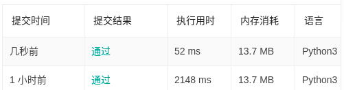

### 300. 最长上升子序列
使用**贪心**＋**二分**将时间复杂度降低为`O(nlogn)`,如果使用的是动态规划,那么时间复杂度为`O(n*n`),两种方法的耗时对比如下图:

```py
class Solution:
    def lengthOfLIS(self, nums: List[int]) -> int:
        size=len(nums)
        if size<2:return size
        cell=[nums[0]]
        for num in nums[1:]:
            if num>cell[-1]:cell.append(num)
            else:
                l,r=0,len(cell)-1
                while l<r:
                    mid=(l+r)//2
                    if cell[mid]<num:l=mid+1
                    else:r=mid
                cell[l]=num
        return len(cell)
```